# 🧰 Automated LaTeX Resume Builder

A fully automated DevOps pipeline that builds a LaTeX resume using Docker and GitHub Actions, and uploads the final PDF to an AWS S3 bucket. This system ensures a reproducible, CI/CD-powered document build process — perfect for showcasing practical DevOps, CI/CD, and cloud integration skills.

## 🚀 Project Overview

This project automates the process of building and deploying a LaTeX-based resume.
Whenever you push new changes to the `main` branch:

1. **GitHub Actions** triggers a workflow.
2. A **Docker container** with TeX Live compiles your LaTeX file into a PDF.
3. The PDF is temporarily stored in an output folder.
4. The final resume is **uploaded to AWS S3** for hosting or sharing.

This project showcases the power of combining **Docker**, **GitHub Actions**, and **AWS S3** to create a simple, cloud-enabled CI/CD system — all for a LaTeX resume.

## 🏗️ System Flow

```mermaid
graph TD
    A[Git Push to main branch] --> B[GitHub Actions Workflow]
    B --> C[Docker Build using texlive/texlive]
    C --> D[LaTeX Compilation → PDF]
    D --> E[Copy PDF to /output folder]
    E --> F[AWS CLI Upload → S3 Bucket]
    F --> G[Publicly accessible resume link]
```



## 🧩 Repository Structure

```
.
├── src/
│   └── main.tex              # Your LaTeX resume source
├── Dockerfile                # Multi-stage Docker build file
├── entrypoint.sh             # Handles saving and S3 upload
├── .github/
│   └── workflows/
│       └── build-upload.yml  # GitHub Actions workflow
├── output/                   # Generated resume output (ignored in .gitignore)
└── README.md                 # This file
```

## ⚙️ GitHub Actions Workflow

The workflow (`.github/workflows/build.yml`) automates the following:

- **Checkout code** from the repository
- **Build Docker image** (`resume-builder`)
- **Run container** with output volume
- **Upload final PDF to AWS S3**
- **Optionally upload artifact** for download via GitHub UI

## 🐳 Dockerfile Explanation

- **Stage 1:** Uses `texlive/texlive:latest` to compile LaTeX into a PDF
- **Stage 2:** Uses `amazon/aws-cli` to upload the PDF to S3
- **Entrypoint:** A shell script that saves the output and uploads it

## 🔑 Environment Variables

Set these in your GitHub repository → **Settings > Secrets and Variables > Actions**

| Variable                | Description            |
| ----------------------- | ---------------------- |
| `S3_BUCKET`             | Name of your S3 bucket |
| `AWS_ACCESS_KEY_ID`     | AWS Access Key         |
| `AWS_SECRET_ACCESS_KEY` | AWS Secret Key         |

## 📄 Example Output

After a successful run, your compiled resume will be available at:

```
https://ashishkus-resume.s3.ap-south-1.amazonaws.com/Ashish_Kushwaha.pdf
```

You can also download it directly from the **Artifacts** tab in the Actions workflow.

## 🧠 Learning Highlights

- **Docker:** Containerized LaTeX environment for consistent builds
- **CI/CD:** Automated pipeline with GitHub Actions
- **AWS Integration:** Secure S3 upload using IAM credentials
- **Multi-Stage Build:** Lightweight production image for deployment

## 💡 Future Enhancements

- Add versioning or timestamp to resume uploads
- Deploy to multiple cloud storage options (GCP/Azure)
- Use GitHub Pages for hosting the compiled PDF
